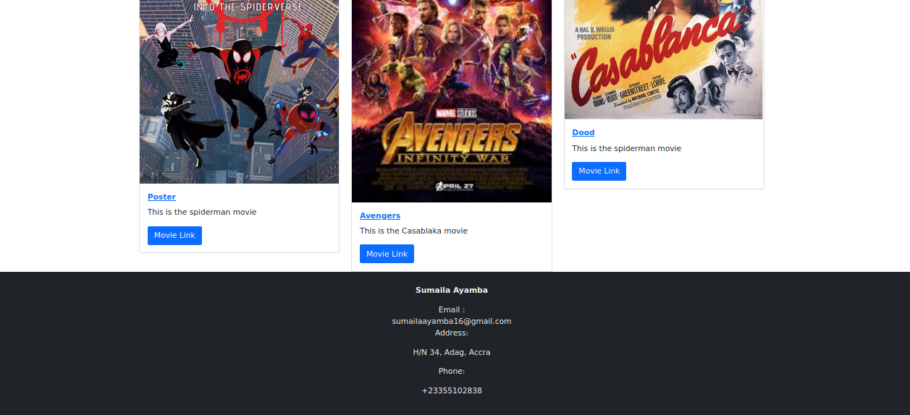
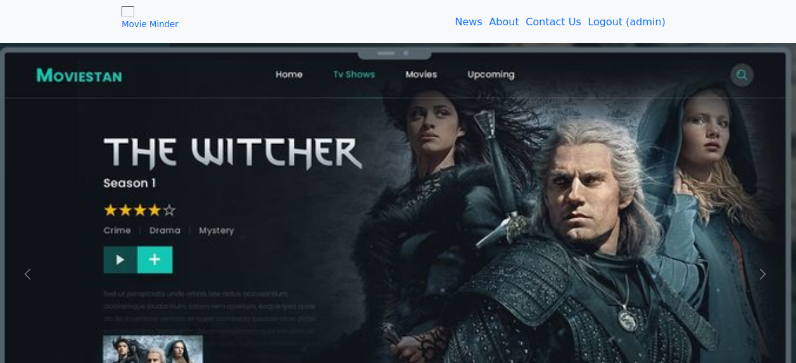
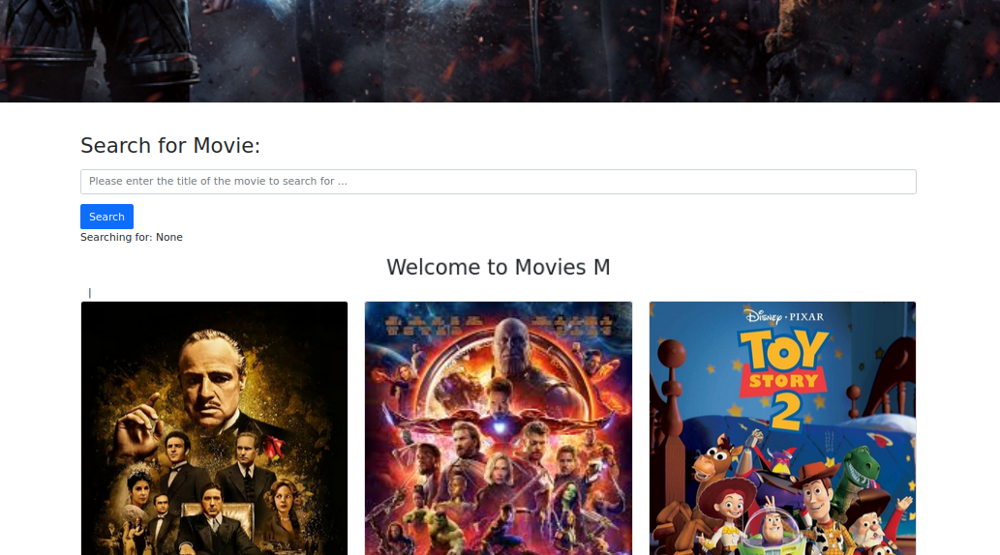
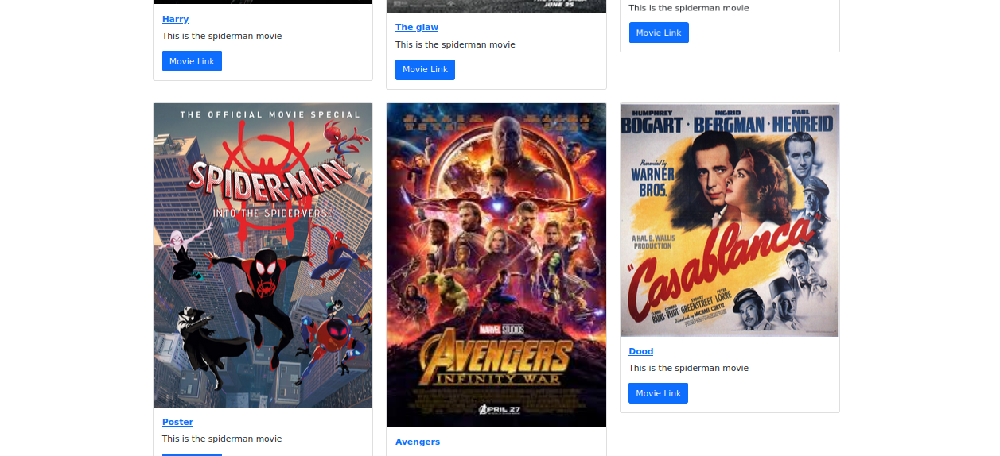
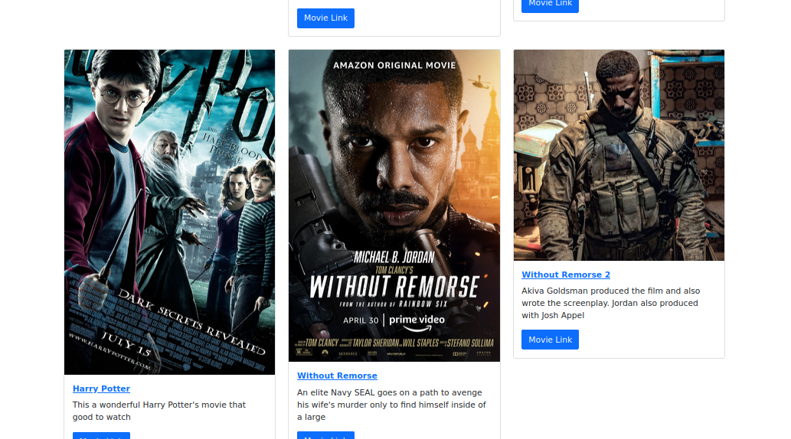
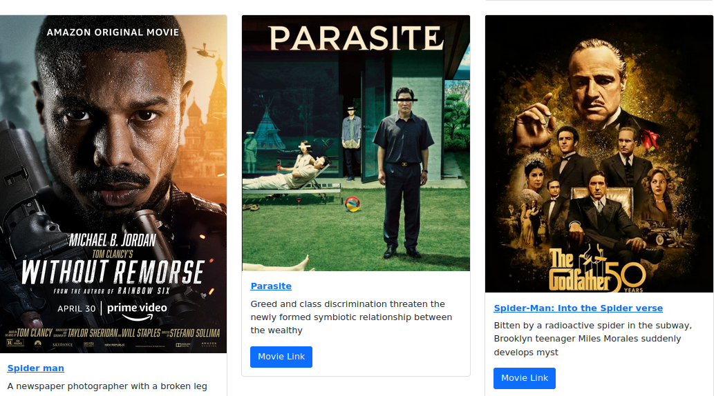
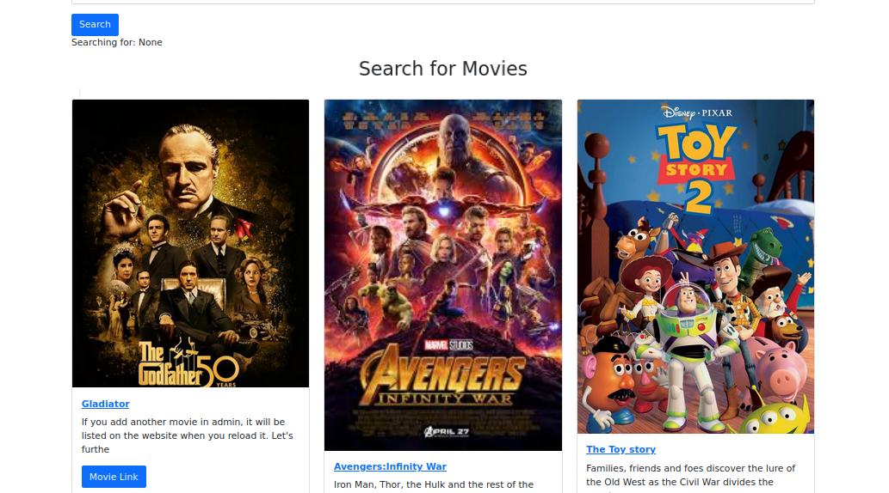

# Understanding the app we will be building
For our project, I will be building a movie reviews app that will allow users to view and
search for movies

Users will also be able to log in and post reviews of any movies they may have watched, They will be able to type in and add their review, Users can see the list of reviews on a movie's page and post, edit, or delete their own
review if they are logged in. They will not be able to edit or delete other users' reviews
though. Through building this app,  will learn a lot of concepts, such as forms, user
authorization, permissions, foreign keys, and more.


# Movie Minder

## Overview

**Movie Minder** is a Django-based web application designed for movie enthusiasts to search, review, and track movies they’ve watched. Users can sign up, search for movies by title, add detailed reviews, and indicate whether they would like to watch the movie again. This application provides a simple, intuitive interface for users to manage their movie experiences and share their opinions with others.

## Features

- **User Authentication**: Secure user sign-up and login system to personalize movie experiences.
- **Movie Search**: Search for movies by title to find information and reviews quickly.
- **Add Reviews**: Users can leave detailed reviews and rate movies based on their experience.
- **Watch Again Indicator**: A unique feature that allows users to mark movies they would like to watch again.
- **Responsive Design**: Optimized for both desktop and mobile devices.









## Technologies Used

- **Backend**: Django (Python)
- **Frontend**: HTML, CSS, Bootstrap
- **Database**: SQLite (development), PostgreSQL (production)
- **Authentication**: Django's built-in authentication system
- **Deployment**: Deployed on Heroku (or specify your deployment platform)

## Installation

1. Clone the repository:

   ```bash
   git clone https://github.com/AyambaSumaila/movie_minder.git
   cd movie_paal

2. Install dependencies:

   ```bash
   pip install -r requirements.txt
   ```

3. Apply migrations:

   ```bash
   python manage.py migrate
   ```

4. Run the development server:

   ```bash
   python manage.py runserver
   ```

5. Access the application at `http://127.0.0.1:8000/` in your web browser.

## Importance & Impact

**Movie Minder** is more than just a movie review application; it’s a showcase of modern web development practices, including:

- **Scalability**: Built with Django, allowing for easy scalability as the user base grows.
- **Best Practices**: Implements secure user authentication, ensuring a safe and personalized experience.
- **Clean Architecture**: Follows MVC (Model-View-Controller) design pattern, promoting code reusability and maintainability.
- **User-Centric Design**: Focuses on user experience with a responsive design, making it accessible on all devices.
- **SEO Optimization**: Incorporates best SEO practices to ensure the application can be easily discovered by users and search engines alike.

### Why It Matters to Recruiters

- **Technical Competence**: Demonstrates proficiency in Django, Python, and web development fundamentals.
- **Problem Solving**: Addresses real-world problems like movie discovery and review management in a user-friendly way.
- **Attention to Detail**: Focus on security, user experience, and performance highlights a commitment to quality.
- **Versatility**: Shows capability to work across different layers of a full-stack application, from database management to front-end design.
- **Deployability**: Experience with deploying web applications on platforms like Heroku, making it production-ready.

## Contributing

We welcome contributions! Please fork this repository and submit a pull request with your improvements.

## License

This project is licensed under the MIT License - see the [LICENSE](LICENSE) file for details.

---

This README template provides a comprehensive overview of your application while highlighting the technical skills and best practices that might attract recruiters.